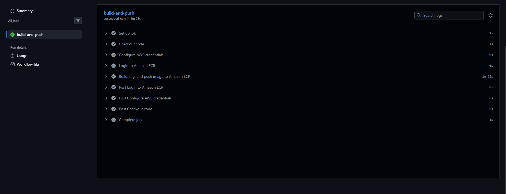
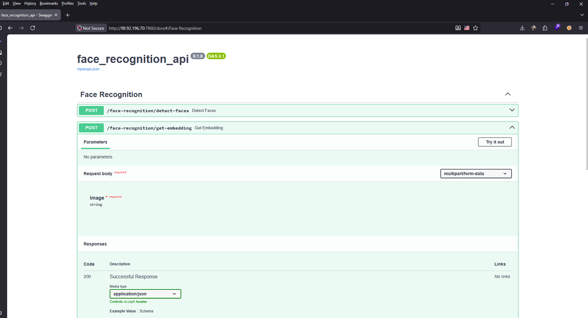

# Bawabetak AI Deployment on AWS ECS Fargate

An automated CI/CD and **Infrastructure as Code (IaC)** pipeline designed to deploy a containerized AI application to **Amazon ECS (Elastic Container Service)** using **Amazon Fargate**, **Amazon ECR**, and **GitHub Actions**.

---

## 🏗️ Architecture Diagram

The following diagram illustrates the end-to-end workflow from code repository push to container deployment, networking layout, security groups, and monitoring:


---

## 🚀 Infrastructure & Workflow Overview

* **Container Registry:** Images are built, tagged, and pushed securely to **Amazon ECR** (`bawabetak-ecs`).
* **Compute Environment:** Runs serverless container tasks on **AWS Fargate** inside an **ECS Cluster** (`bawabetak-ecs-clusterruns`).
* **Networking & Security:** 
  * Configured within a custom **VPC** (`10.0.0.0/16`) utilizing a **Public Subnet** (`10.0.1.0/24`) connected via an **Internet Gateway**.
  * Security Group (`bawabetak-ecs`) allows inbound traffic on port `7860/tcp` directly to the task public IP.
* **Logging & IAM:** 
  * Application logs are streamed and retained for 7 days in **Amazon CloudWatch** (`/ecs/bawabetak-ecs`).
  * Permissions are securely managed via **IAM execution roles**.

---

## 🔑 Key AWS Services & Concepts

* **ECS Fargate:** Task definitions, services, capacity providers; no server management.
* **ECR:** Private container registry with image vulnerability scanning on push.
* **ALB + Target Groups:** Route traffic to multiple ECS services by path (e.g. `/api/orders`).
* **AWS Cloud Map:** Service discovery so containers find each other by DNS name.
* **Secrets Manager:** Inject database credentials and API keys into containers at runtime.
* **ElastiCache (Redis):** Shared session store across stateless container instances.
* **CodePipeline + CodeDeploy:** CI/CD pipeline with blue/green deployment and automatic rollback.
* **X-Ray:** Distributed tracing across microservices with service map visualization.

---

## 🎯 Learning Outcomes

* Build and push Docker images to ECR and configure ECS task definitions.
* Design ECS Fargate services with correct IAM task roles and execution roles.
* Implement service-to-service communication using Cloud Map DNS-based discovery.
* Configure ALB path-based routing rules to front multiple microservices.
* Set up blue/green deployments using CodeDeploy with ECS integration.
* Manage secrets securely with Secrets Manager and avoid hardcoded credentials.

---

## 🟢 CI/CD Pipeline Status

The automated GitHub Actions workflow successfully authenticates with AWS, builds the container image, and pushes it to Amazon ECR:



---

## 🔌 API Documentation (Swagger UI)

The deployed ECS Fargate container exposes an interactive FastAPI documentation interface at `/docs`, featuring live endpoints for face detection and embedding generation:



---

## 🧪 API Testing & Verification

### 1. Terminal Testing (`curl`)
You can test the face detection endpoint directly from the terminal using `curl`:

```bash
curl -X POST "[http://98.92.196.70:7860/face-recognition/detect-faces](http://98.92.196.70:7860/face-recognition/detect-faces)" \
  -H "accept: application/json" \
  -H "Content-Type: multipart/form-data" \
  -F "image=@test.jpg"


Expected Response:
{"face_count":1}

