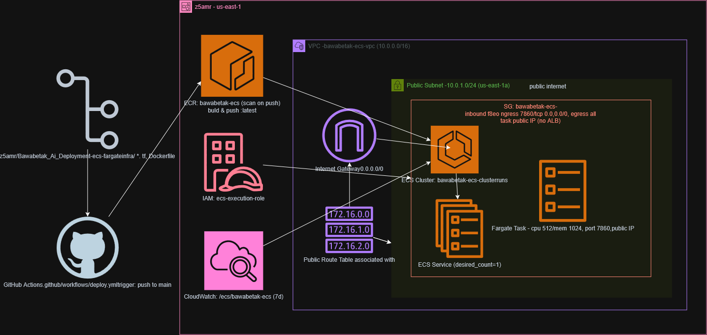

# Bawabetak AI Deployment on AWS ECS Fargate

An automated CI/CD and **Infrastructure as Code (IaC)** pipeline designed to deploy a containerized AI application to **Amazon ECS (Elastic Container Service)** using **AWS Fargate**, **Amazon ECR**, and **GitHub Actions**.

## 🏗️ Architecture Diagram

The following diagram illustrates the end-to-end workflow from code repository push to container deployment, networking layout, security groups, and monitoring:

## 🚀 Infrastructure & Workflow Overview

* **CI/CD Pipeline:** Powered by **GitHub Actions** (`.github/workflows/deploy.yml`), triggered automatically on a `push` to the `main` branch.
* **Container Registry:** Images are built, tagged, and pushed securely to **Amazon ECR** (`bawabetak-ecs`)[cite: 5].
* **Compute Environment:** Runs serverless container tasks on **AWS Fargate** inside an **ECS Cluster** (`bawabetak-ecs-clusterruns`)[cite: 5].
* **Networking & Security:** 
  * Configured within a custom **VPC** (`10.0.0.0/16`) utilizing a **Public Subnet** (`10.0.1.0/24`) connected via an **Internet Gateway**[cite: 5].
  * Security Group (`bawabetak-ecs`) allows inbound traffic on port `7860/tcp` directly to the task public IP[cite: 5].
* **Logging & IAM:** 
  * Application logs are streamed and retained for 7 days in **Amazon CloudWatch** (`/ecs/bawabetak-ecs`)[cite: 5].
  * Permissions are securely managed via **IAM execution roles**[cite: 5].